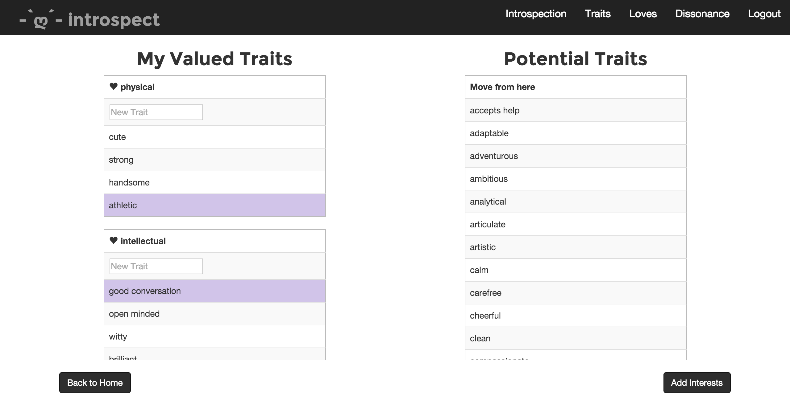
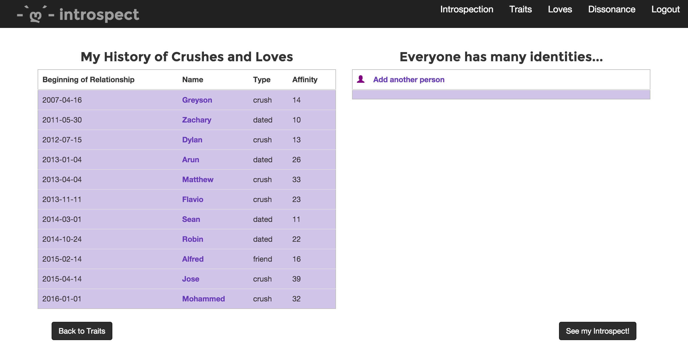
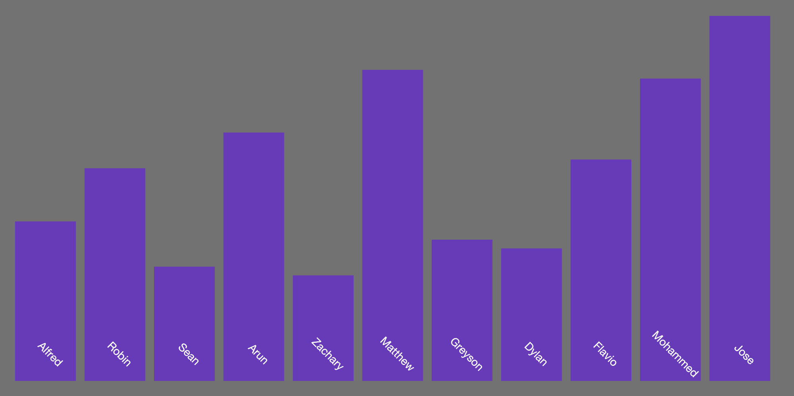
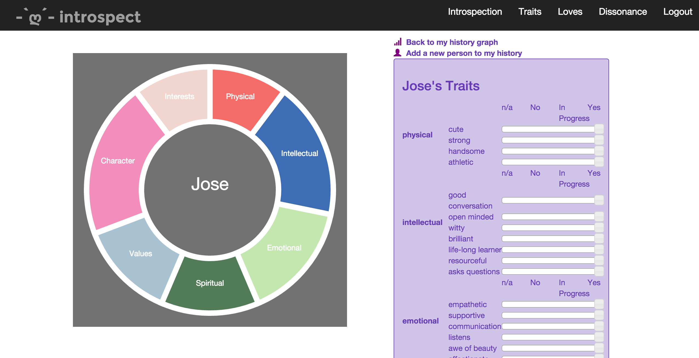
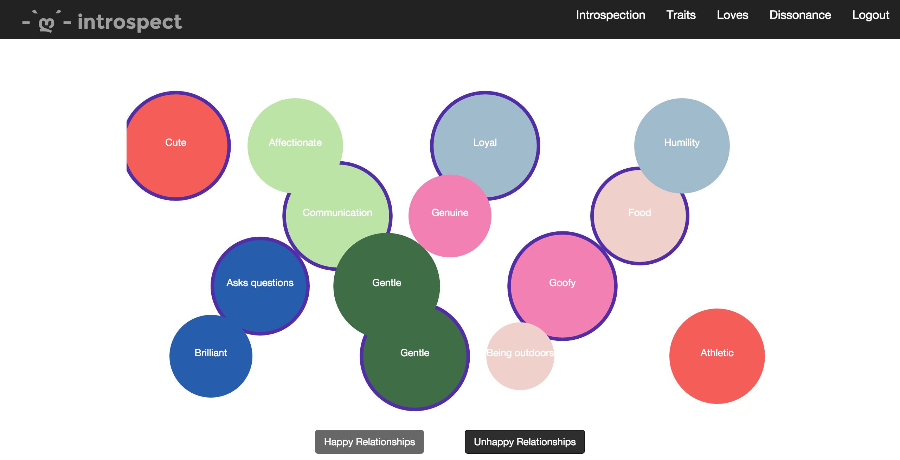

# Earshot

A location-based music streaming app.  Earshot allows users to discover exclusive local music.  It allows artists to connect with nearby audiences, promote special events and performancs, and give back to their communities.  Artists can upload a song by selecting a location with a radius of up to 5km by simply clicking and dragging on an embedded Google map.  If users are within the selected radius, the song will become available in their mobile app.

Earshot was conceived of as a creative way to share music, a guerilla marketing tool for artists, and a tool for bringing back some of the intimacy, self-ownership, and pride in local music scenes that web-based music sharing platforms continue to degrade.

This app was built in 7 days as a final project of [DevBootcamp](https://devbootcamp.com)'s 2016 Chicago Sea Lions.  We hope this app serves as a proof of concept and that similar technologies may be integrated with previously established services such as SoundCloud, Spotify or Apple Music. There is still much work to do on this app so we've decided to keep the repository private, but would still like to display the work we have thus far. Check it out on [Heroku](https://evening-gorge-29235.herokuapp.com), or take a look at the photos below.

## Overview

The user starts by selecting the traits that are important to them in a relationship. These traits fall under predetermined categories. Within each category, the user can select a favorite trait.

Create a chronological list of relationships, including crushes, boy/girlfriends, and hookups. Easily edit this list at any time.

From the data in this list, Introspect will create a history bar graph that displays all interests in relation to the time the user and interest were together and their affinity to each other.

Clicking through this bar graph takes us to individual break downs of each interest. From here, the user can assign a score to each interest based on how they met their desired traits.

Once the user has filled out their interests and traits, they can recieve a custom analysis of what they find truly important in a relationship. Users initially selected which traits were important to them in each category. They can also select the top five relationship where they were happiest or least happy. Introspect looks at all of this data, and creates a bubble graph representing the traits that were most prevalent in these relationships compared to the traits the user initially identified as important to them.

## Stack

Earshot's backend was created as a custom Rails API and served on the mobile front end with Ionic and web front end as a Rails web app. The app made extensive use of the Google Maps API embedded Javascript map, drawing, and heat maps add-ons as well as Amazon Web Services and CloudFront for storage and streaming, and Geocoder for web-based location services.

## Team

This project was completed with a team of five DevBootcamp students.

<a href='https://github.com/yaboichrissyb'>Chris Bunkers</a> | <a href='https://github.com/byronbenjamin'>Byron Gage</a> | <a href='https://github.com/creaumond'>Connor Reaumond</a>
:---: | :---: | :---:
 |  | 
 **<a href='https://github.com/kromitj'>Mitch Kroska
</a>**| **<a href='https://github.com/scottjoseph'>Joseph Scott</a>**
 | 
